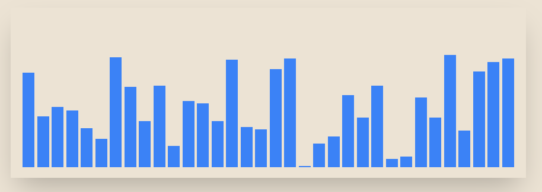

# VALGO



## 📊 Live Demo
Check out the live demo [here](https://quinta0.github.io/valgo/).

## 🚀 About The Project
Algorithm Visualizer is an interactive web application designed to help users understand and visualize various sorting algorithms. Built with Next.js and React, this project aims to make learning algorithms more engaging and intuitive.

### 🎯 Features
- Visualize multiple sorting algorithms in real-time
- Adjustable array size for different complexity scenarios
- Play, pause, and reset functionalities
- Detailed explanations for each algorithm
- Responsive design for various screen sizes

### 🧮 Supported Algorithms
- Bubble Sort
- Insertion Sort
- Merge Sort
- Heap Sort
- Quick Sort

## 🛠️ Built With
- [Next.js](https://nextjs.org/)
- [React](https://reactjs.org/)
- [TypeScript](https://www.typescriptlang.org/)
- [Tailwind CSS](https://tailwindcss.com/)

## 🏁 Getting Started

To get a local copy up and running, follow these simple steps.

### Prerequisites
- Node.js (v14 or later)
- npm

### Installation

1. Clone the repo
   ```sh
   git clone https://github.com/Quinta0/valgo.git
   ```
2. Navigate to the project directory
   ```sh
    cd valgo
    ```
3. Install dependencies
   ```sh
    npm install
    ```
4. Start the development server
   ```sh
    npm run dev
    ```
5. Open [http://localhost:3000](http://localhost:3000) in your browser

### 🎨 Usage

- Select a sorting algorithm from the dropdown menu.
- Adjust the array size using the slider if desired.
- Click the "Start" button to begin the visualization.
- Use the "Pause" and "Resume" buttons to control the animation.
- Click "Reset" to generate a new random array.
- Read the algorithm explanation provided below the visualization.

### 🤝 Contributing
Contributions are what make the open source community such an amazing place to learn, inspire, and create. Any contributions you make are greatly appreciated.

1. Fork the Project
2. Create your Feature Branch `git checkout -b feature/AmazingFeature`
3. Commit your Changes `git commit -m 'Add some AmazingFeature'`
4. Push to the Branch `git push origin feature/AmazingFeature`
5. Open a Pull Request

### 📝 License
Distributed under the MIT License. See LICENSE for more information.

