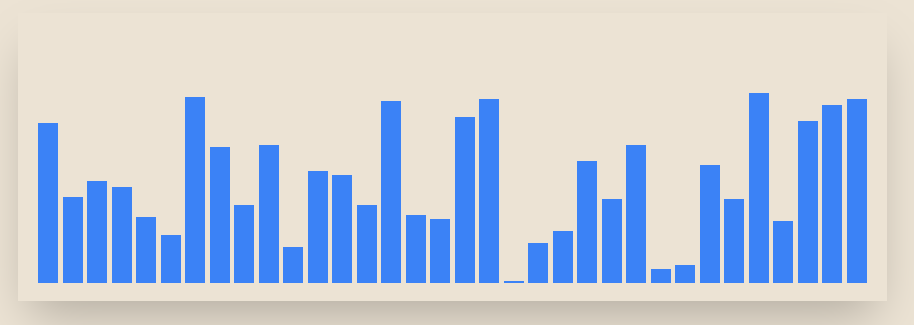

# VALGO



## Live Demo
Check out the live demo [here](https://quinta0.github.io/valgo/).

## About The Project
Valgo is an interactive, narrated visualizer for nine classic sorting algorithms, redesigned in a 3Blue1Brown-inspired style: a dark, grid-lined canvas, smooth per-step animation, a live "what's happening and why" commentary track, and a growth-curve chart that makes Big-O visually concrete.

Every algorithm runs once, up front, recording a full sequence of steps (compare, swap, pivot selection, merge, bucket placement...). The player then replays that sequence at any speed, and can be paused or scrubbed like a video — nothing is re-computed on the fly.

### Features
- Nine algorithms, each with color-coded state (comparing, swapping, pivot, sorted) and a sliding pointer that always shows where the algorithm is "looking"
- A synced narration panel explaining each step in plain language, in all 10 supported languages
- A growth-curve chart plotting O(n²), O(n log n), and O(n + k) side by side, with a live marker at the current array size
- Scrubbable timeline, adjustable speed, and live comparison/write counters
- Adjustable array size, shuffle, and reset
- Responsive, dark, 3Blue1Brown-inspired visual design

### Supported Algorithms
- Bubble Sort
- Insertion Sort
- Merge Sort
- Heap Sort
- Quick Sort

## Built With
- [Next.js](https://nextjs.org/)
- [React](https://reactjs.org/)
- [TypeScript](https://www.typescriptlang.org/)
- [Tailwind CSS](https://tailwindcss.com/)

## Getting Started

To get a local copy up and running, follow these simple steps.

### Prerequisites
- Node.js (v14 or later)
- npm

### Installation

1. Clone the repo
   ```sh
   git clone https://github.com/Quinta0/valgo.git
   ```
2. Navigate to the project directory
   ```sh
    cd valgo
    ```
3. Install dependencies
   ```sh
    npm install
    ```
4. Start the development server
   ```sh
    npm run dev
    ```
5. Open [http://localhost:3000](http://localhost:3000) in your browser

### Usage

- Select a sorting algorithm from the dropdown menu.
- Adjust the array size using the slider if desired.
- Click the "Start" button to begin the visualization.
- Use the "Pause" and "Resume" buttons to control the animation.
- Click "Reset" to generate a new random array.
- Read the algorithm explanation provided below the visualization.

### Contributing
Contributions are what make the open source community such an amazing place to learn, inspire, and create. Any contributions you make are greatly appreciated.

1. Fork the Project
2. Create your Feature Branch `git checkout -b feature/AmazingFeature`
3. Commit your Changes `git commit -m 'Add some AmazingFeature'`
4. Push to the Branch `git push origin feature/AmazingFeature`
5. Open a Pull Request

### License
Distributed under the MIT License. See LICENSE for more information.

